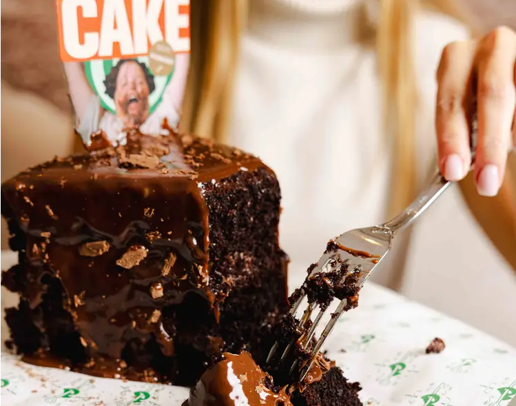

Café Confidential

Download the files:

Now try to determine where the café is located based on items in the
file:

One of files are corrupted so you will need to use cyberchef or a tool
of your choice to get the image from the corrupted file:

Now take a photo or screenshot of the image and use a reverse image tool
to find out where the photo was taken:

I used google lens within my phone but you can also search "Google
Reverse Image Search"

Click the search by image function

paste your image and search

As you see we get a location in the results, now search this based on
the location closest to Harrod's (The second image).

If you click this first link, you will get taken to the website that has
the address, enter it according to the CTF parameters.

How I approached this task was I first got the image that worked, and
then reverse image searched on that image. 

And then after I extracted the image from the corrupted/ unsupported
file format, I then reverse image searched on that file as well and
found the café!

Flag: C1{Parker\'s_Lowndes}

