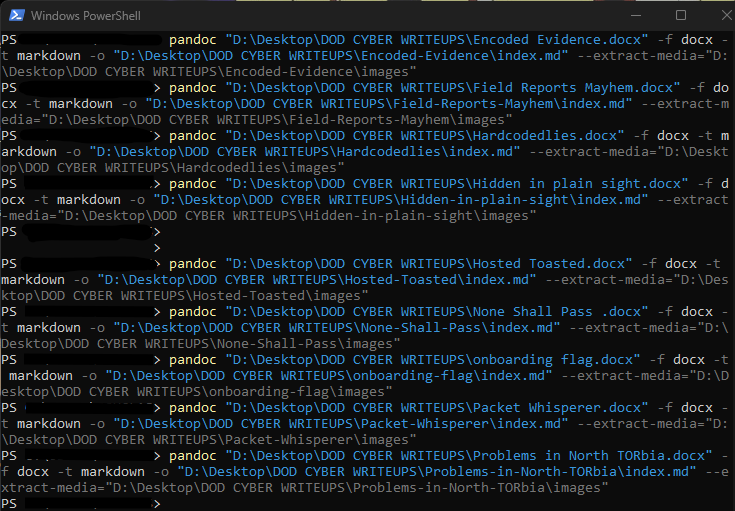

# Cyber Journal Entry - August 4

- I finally uploaded my writeups from the Summer 2025 DOD Cyber Sentinel Challenge to my GitHub!
- Learned how to use pandoc in Powershell to convert word documents to Markdown.

- Finishing up the WebSockets lab on the web security academy has shown me that you can use the codes embedded in websites to create payloads! For some reason, I thought that payloads needed to be crafted from scratch. **use what is already there**
