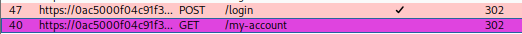
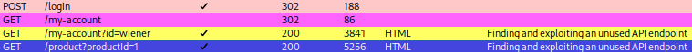
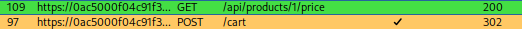

<!DOCTYPE html>
<html lang="en">
<head>
  <meta charset="UTF-8">
  <title>My Cyber Lab</title>
  <link rel="stylesheet" href="assets/style.css">
</head>

**Lab:** Finding and exploiting an unused API endpoint

**Date Started:** August 5, 2025

**Date Completed:** August 6, 2025

**Platform:** PortSwigger Web Security Academy

**Tools Used:** Burp Suite Professional, Chromium, Firefox, Notes

**OBJECTIVE:** Exploit a hidden API endpoint to buy a **Lightweight l33t
Leather Jacket**. You can log in to your own account using the following
credentials: wiener:peter.

**Environment Setup:** I am simply using the latest version of kali
Linux, and utilizing Burp Suite's built in browser to complete all the
necessary steps.

**Discovery:** I first opened the built in burp suite browser logged
into the account using the credentials provided. After populating in
Burp's HTTP History tab, I was able to identify a few API endpoints that
looked interesting.

After logging in with the credentials I noticed the **/login** and
**/my-account** endpoints:

Navigating to the **Lightweight l33t Leather Jacket** product page, a
few more endpoints have populated on burp suite:

I start by adding 1 to my cart to see what happens: 

After clicking "Add to cart" two more endpoints appear:

With the **/api/products/1/price** endpoint selected, I begin by sending
the response to the repeater tab, but notice the price: 
Once I sent everything to the repeater, I
realized I needed to dig deeper to get the desired result (buying a
jacket with no money, so I went back to the HTTP History tab and went to
the **/cart** endpoint and manipulated a few things: And after hitting the place order button,
you get the **/cart?err=INSUFFICIENT_FUNDS** endpoint, and here is where
it gets interesting. Send this to repeater and change the *METHOD* from
**GET** to **POST** and then send the Request, Notice the response of
"Missing parameter 'productId'": 
*Missing parameter, huh? Reminds me of
this:*

*Could I use this with the /cart?err=INSUFFICIENT FUNDS?*

*Gonna test the theory with repeater:*

*No luck there but thought I'd try.*

*What if I tried to overload the system with a large quantity of
jackets?*

*No luck there.*

So I went back to the **/cart** endpoint and noticed this:

At the bottom of the request, and POST /cart/checkout has a csrf at the
bottom of the request, and the HTTP/2 gives you a 303 See Other: 

I started over and played around with the burp intruder, this time
focusing on burp intruder and using HTTP verbs and somehow got my cart
to read -10! I realized after going to the leather jacket page and
then manipulating the quantity, you will get extra parameters in the
request: 

Manipulate the ***quantities*** in the ***Request and then send,***

This shows that the quantities are in fact being updated.

My cart quantity before hitting send and refreshing the page:

This is my cart quantity, ***after*** refreshing the page:

So now you go to the cart page and click the "Place order" button:

\
Upon hitting place order, you will get two different endpoints

Notice that the methods are different, one is a GET, while the other is
a POST, examining the POST /cart/checkout request:

Honestly, this is the point where I started trying any and everything to
try and figure out what to do. First, I went to the cart endpoint and
had Burp Suite scan it:
   

You don't necessarily need to do a deep scan at all though, I just
figured that it would be a good scan to check anything that I may have
missed. Here is the completed scan, and some interesting items: 

A **/productPrice.js** script?! So of course I sent it to the repeater
to investigate it, and two blocks of javascript code stood out to me:
 

I tried placing these elements in the developer tools but I got an error
there and a deadend, so I thought about throwing the js in to visual
code to look at it more clearly and edit it. But then I noticed that the
source for the **/cart?err=INSUFFICIENT_FUNDS** is the
***/resources/js/api/productPrice.js!*** 

I went down another rabbit hole and consulted chatgpt. I scraped the
entire idea and just decided that I wanted to try to manipulate the
price again, and the problem was so easy it's crazy how long I spent on
this, so let's walk through what I did wrong: Actually I see that I fixed it when I first
did it, but the solution is to change the price parameter by changing
the method to PATCH and then editing the price parameter, (I did this
several times and kept getting error flags) the problem was that I had
double quotes when placing the zero, that is why I kept getting the
error. The api needs it formatted like this:

{\"price\": 0,\"message\":\"&#x1F525; 17 users have purchased this in
the last 8 minutes\"}

NOT:

{ \"price\":\"\$0.00\",\"message\":\"&#x1F525; 17 users have purchased
this in the last 8 minutes\"}

You must get rid of the quotes, and then add then content type header,
(preferably below cookie session (where the arrow points).

So now after I added the jacket to my cart you will see that it is now
showing as \$0.00. I can now place my order:

And after **SO MANY HOURS** I finally have my Lightweight "l33t" Leather
Jacket. \~yayyy...

**LESSONS LEARNED:**

Stay persistent, even when errors persist. Although I didn't show it in
the walkthrough, there were a multitude of times when I was at that very
endpoint GET **/api/products/1/price** and added the parameters in the
response. But because of the errors I received, I chose other routes.
However, if I'd have just seen that it was reading the double quotes as
a string, as noted by the error absence of double quotes around 400,
then I would have solved this lab a lot sooner.

Here are the error messages that I am talking about:

1.  I copied the parameters and set the method to OPTIONS, to see what
    methods are allowed. The price was originally \$1337.00: Notice that in the response Allowed
    methods are **GET,** and **PATCH.** So I kept everything and sent it
    as a PATCH Method:  \* if you get unauthorized that just
    means that you need to sign in, the next screenshot is the same
    thing with the user signed in \*

2.  Send the PATCH Method with the CORRECT parameters, notice the error
    messages I received, \"error\":\"Only \'application/json\'
    Content-Type is supported\" :Upon correcting the content type
    header, I noticed that I got another error, that stated that the
    "'price' parameter must be a valid non-negative integer": This is where I moved on, and got lost
    in another rabbit hole but all I had to do here was remove the
    double quotations from the "0.00", and make it a non negative
    **valid** integer. So I had to also get rid of the .00, and keep 0.
    this is also why I said it was hidden in plain sight because of the
    code parameter that says 400. So remove the double quotes and the
    price will change. Keep the Request as **PATCH**: 

3.  Refresh your session in the browser, if you go to the homepage the
    jacket will be \$0.00, add the item to the cart and purchase it!

> 
>
>  

